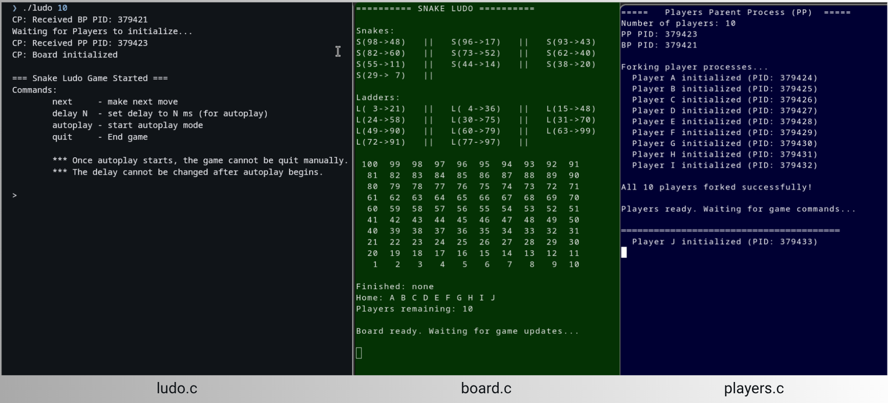

<div align="center">
    

</div>
<p align="center">
    <br>
    <a href="#getting-started">Getting Started</a> |
    <a href="#modes-of-execution">Modes of Execution</a> |
    <a href="#clean-executables--shared-memory">Cleanup</a> |
    <a href="https://github.com/myself-aman-tudu/snake-ladder-simulation-operating-system/blob/main/Snakes-Ladders-Assignment.pdf">Assignment</a>
</p>

## Snakes & Ladders simulation using fork, pipes & shared memory
This project implements a multi-process version of the Snake Ludo (Snakes and Ladders) game using System V shared memory and signals.

A coordinator process manages user input and synchronization, while separate processes handle board display and player actions in dedicated xterm windows.

Inter-process communication is achieved through shared memory segments and pipes, with signals used for turn-based synchronization.

## Getting Started

### Clone the Repository

Clone the repository in your local machine using `git clone` and then navigate to the project directory:

```bash
$ git clone https://github.com/myself-aman-tudu/snake-ladder-simulation-operating-system.git

$ cd snake-ladder-simulation-operating-system
```

### Build Executables Using Makefile

Compile all files using `make run`, make sure `ludo.txt` is present in the directory.

```
$ make run
```
Then run `./ludo` with number of player as argument.

```
$ ./ludo 4
```

## Modes of execution

The game can be executed in interactive mode (manual turn control) or in autoplay mode with a configurable delay between moves.

Use the following command to trigger the next player movement in interactive mode.

```
> next
```

Triggers the next player’s turn manually. The coordinator signals the player-parent process to initiate the next move.

```
> delay N
```

Sets the delay (in milliseconds) between moves during autoplay mode. This controls the animation speed of the game.

```
> autoplay
```

Switches the game into automatic mode. The coordinator automatically triggers moves at the configured delay interval until the game finishes.

**Once autoplay mode begins, manual quitting is disabled and the delay value cannot be modified.**

```
> quit
```

Terminates the game gracefully (only available in interactive mode).

## Clean Executables & Shared Memory

All processes terminate gracefully at the end of execution, ensuring proper detachment and removal of shared memory segments.

To remove compiled executables:
```
$ make clean
```

After termination, you can verify that no shared memory segments remain using:
```
$ ipcs -m
```

If any shared memory segments still exist (e.g., due to abnormal termination), remove them manually using:
```
ipcrm -a <shmid>
```
`shmid` is the shared memory id ( check after running `ipcs -m` command)

This ensures a clean environment before the next run.
